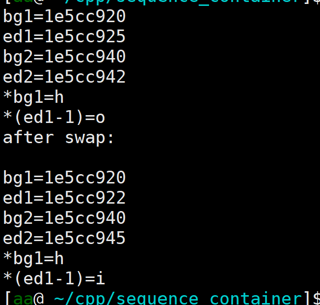

# IO类
## iostream、fstream、sstream
iostream头文件定义了标准读写类型：
1. iostream(读写流)
2. istream(从流读入数据)
3. ostream(向流写入数据)
fstream继承自iostream，定义了文件读写类型：
1. fstream(读写文件)
2. ifstream(从文件读取数据)
3. ofstream(向文件写入数据)
ssteam继承自iostream，定义了string对象读写类型：
1. stringstream(读写string对象)
2. istringstream(从string对象读取数据)
3. ostringstream(向string对象写入数据)

### IO对象无拷贝
由于不能拷贝IO对象，因此进行IO操作的函数以引用的方式进行参数传递和返回。

### 流的状态
有流对象s
```c++
s.rdstate();    //返回流的状态
s.clear();  //将流的状态置为有效，将goodbit置位
s.setstate(state);   //state属于流的状态类型，setstate将流的状态置为state的状态
```
### 输出缓冲
数据先被保存在缓冲区，随后进行某些操作后，才会输出至文件。
1. main函数结束，缓冲输出。
2. 缓冲区满，缓冲输出。
3. 使用换行符endl显式缓冲输出。
4. 使用unitbuf，等效于flush刷新，使用nounitbuf来回到正常的缓冲方式。
```c++
cout<<unitbuf;
cout<<"hi";  //"hi"会直接从缓冲区中刷新出来
cout<<nounitbuf;
cout<<"hi";     //"hi"不会直接从缓冲区中刷新出来，而是先保存在缓冲区中
while(1){}
```
5. 关联的输入和输出流，当输出流的缓冲区中有数据没有输出到设备上时，进行输入的情况下，会先刷新的输出流的缓冲区。
```c++
int val;
cout<<"hi"; //"hi“会直接从缓冲区中刷新出来
cin>>val;
while(1){}
```
```c++
ios::sync_with_studio(false);   //关闭C++标准流与C标准流之间的同步
cin.tie(nullptr);   //切断cin和cout的关联
int val;
cout<<"hi"; //"hi"不会从缓冲区刷新出来
cin>>val;
while(1){}
```
### 从流中读取数据到string对象中
```c++
ifstream ifs;
string str;
ifs.open("txt.txt",ios_base::in|ios_base::app);
while(getline(ifs,str)){}   //按换行为间隔读取
while(ifs>>str){}           //按空格为间隔读取
```
### out文件模式下打开文件丢弃已有数据
ofstream类型的流对象默认文件打开模式为ios_base::out
```c++
ofstream ofs("txt.txt");    //隐含out和trunc
ofs<<"hello";
ofs.close();    //此时txt.txt文件中有"hello"
ofs.open("txt.txt",ios_base::app);  //此时txt.txt文件内容不变
ofs.open("txt.txt");      //此时txt.txt文件内容清空
```
## istringstream
使用场景：当获取一行数据时，可以用istringstream类型的对象绑定在这一行数据，然后可以分别读取每一个单词
```c++
getline(cin,line);
string word;
istringstream iss(line);
while(iss>>word){}; //每次读取一个单词  
```
## ostringstream
使用场景：实际上是将写入操作转化为向string对象添加字符

# 顺序容器
## 赋值操作
前提是两个容器的类型和元素的类型相同
赋值操作时，等号左边容器内部的迭代器、引用和指针会失效
实际上，这也是分情况的：
1. 当等号左边的容器大小大于右边容器时，迭代器的内容是部分变化的，begin()的值不变，而因为左边容器的减小，导致end()的值发生变化。引用的迭代器也是跟随原容器的迭代器的变化而变化，指针同理。
```c++
    vector<int> v1={1,9,5};
    vector<int> &yin_v1=v1;
    auto bg=v1.begin();
    auto ed=v1.end();
    auto yin_bg=yin_v1.begin();
    auto yin_ed=yin_v1.end();
    printf("bg=%x\ned=%x\n",bg,ed);
    cout<<"&bg="<<&bg<<endl<<"&ed="<<&ed<<endl;
    printf("yin_bg=%x\nyin_ed=%x\n",yin_bg,yin_ed);
    cout<<"&yin_bg="<<&yin_bg<<endl<<"&yin_ed="<<&yin_ed<<endl;
    cout<<"*(yin_v1.begin())="<<*(yin_v1.begin())<<endl;
    cout<<"*(yin_v1.end()-1)="<<*(yin_v1.end()-1)<<endl;
    cout<<v1.capacity()<<endl;
    cout<<v1.size()<<endl;

    vector<int> v2={3,2};
    auto bg2=v2.begin();
    auto ed2=v2.end();
    printf("bg2=%x\ned2=%x\n",bg2,ed2);
    cout<<"&bg2="<<&bg2<<endl<<"&ed2="<<&ed2<<endl;
    cout<<v2.capacity()<<endl;
    cout<<v2.size()<<endl;

    v1=v2;
    cout<<"after fuzhi:"<<endl<<endl;

    bg=v1.begin();
    ed=v1.end();
    yin_bg=yin_v1.begin();
    yin_ed=yin_v1.end();
    printf("bg=%x\ned=%x\n",bg,ed);
    cout<<"&bg="<<&bg<<endl<<"&ed="<<&ed<<endl;
    printf("yin_bg=%x\nyin_ed=%x\n",yin_bg,yin_ed);
    cout<<"&yin_bg="<<&yin_bg<<endl<<"&yin_ed="<<&yin_ed<<endl;
    cout<<"*(yin_v1.begin())="<<*(yin_v1.begin())<<endl;
    cout<<"*(yin_v1.end()-1)="<<*(yin_v1.end()-1)<<endl;
    cout<<v1.capacity()<<endl;
    cout<<v1.size()<<endl;

```

2. 当等号左边的容器大小等于右边容器时，迭代器的内容不变，引用也不变，指针也不变。
```c++
    vector<int> v1={1,9};
    vector<int> &yin_v1=v1;
    auto bg=v1.begin();
    auto ed=v1.end();
    auto yin_bg=yin_v1.begin();
    auto yin_ed=yin_v1.end();
    printf("bg=%x\ned=%x\n",bg,ed);
    cout<<"&bg="<<&bg<<endl<<"&ed="<<&ed<<endl;
    printf("yin_bg=%x\nyin_ed=%x\n",yin_bg,yin_ed);
    cout<<"&yin_bg="<<&yin_bg<<endl<<"&yin_ed="<<&yin_ed<<endl;
    cout<<"*(yin_v1.begin())="<<*(yin_v1.begin())<<endl;
    cout<<"*(yin_v1.end()-1)="<<*(yin_v1.end()-1)<<endl;
    cout<<v1.capacity()<<endl;
    cout<<v1.size()<<endl;

    vector<int> v2={3,2};
    auto bg2=v2.begin();
    auto ed2=v2.end();
    printf("bg2=%x\ned2=%x\n",bg2,ed2);
    cout<<"&bg2="<<&bg2<<endl<<"&ed2="<<&ed2<<endl;
    cout<<v2.capacity()<<endl;
    cout<<v2.size()<<endl;

    v1=v2;
    cout<<"after fuzhi:"<<endl<<endl;

    bg=v1.begin();
    ed=v1.end();
    yin_bg=yin_v1.begin();
    yin_ed=yin_v1.end();
    printf("bg=%x\ned=%x\n",bg,ed);
    cout<<"&bg="<<&bg<<endl<<"&ed="<<&ed<<endl;
    printf("yin_bg=%x\nyin_ed=%x\n",yin_bg,yin_ed);
    cout<<"&yin_bg="<<&yin_bg<<endl<<"&yin_ed="<<&yin_ed<<endl;
    cout<<"*(yin_v1.begin())="<<*(yin_v1.begin())<<endl;
    cout<<"*(yin_v1.end()-1)="<<*(yin_v1.end()-1)<<endl;
    cout<<v1.capacity()<<endl;
    cout<<v1.size()<<endl;

```

3. 当等号左边的容器大小小于右边容器时，迭代器的内容全部都变化，引用也变化，指针也变化。
```c++
vector<int> v1={1};
    vector<int> &yin_v1=v1;
    auto bg=v1.begin();
    auto ed=v1.end();
    auto yin_bg=yin_v1.begin();
    auto yin_ed=yin_v1.end();
    printf("bg=%x\ned=%x\n",bg,ed);
    cout<<"&bg="<<&bg<<endl<<"&ed="<<&ed<<endl;
    printf("yin_bg=%x\nyin_ed=%x\n",yin_bg,yin_ed);
    cout<<"&yin_bg="<<&yin_bg<<endl<<"&yin_ed="<<&yin_ed<<endl;
    cout<<"*(yin_v1.begin())="<<*(yin_v1.begin())<<endl;
    cout<<"*(yin_v1.end()-1)="<<*(yin_v1.end()-1)<<endl;
    cout<<v1.capacity()<<endl;
    cout<<v1.size()<<endl;

    vector<int> v2={3,2};
    auto bg2=v2.begin();
    auto ed2=v2.end();
    printf("bg2=%x\ned2=%x\n",bg2,ed2);
    cout<<"&bg2="<<&bg2<<endl<<"&ed2="<<&ed2<<endl;
    cout<<v2.capacity()<<endl;
    cout<<v2.size()<<endl;

    v1=v2;
    cout<<"after fuzhi:"<<endl<<endl;

    bg=v1.begin();
    ed=v1.end();
    yin_bg=yin_v1.begin();
    yin_ed=yin_v1.end();
    printf("bg=%x\ned=%x\n",bg,ed);
    cout<<"&bg="<<&bg<<endl<<"&ed="<<&ed<<endl;
    printf("yin_bg=%x\nyin_ed=%x\n",yin_bg,yin_ed);
    cout<<"&yin_bg="<<&yin_bg<<endl<<"&yin_ed="<<&yin_ed<<endl;
    cout<<"*(yin_v1.begin())="<<*(yin_v1.begin())<<endl;
    cout<<"*(yin_v1.end()-1)="<<*(yin_v1.end()-1)<<endl;
    cout<<v1.capacity()<<endl;
    cout<<v1.size()<<endl;
```


由以上三种情况可以发现，原容器、引用的迭代器的位置均不变，相应的，指针的位置也不变。

## vector的push_back操作
对于此操作来说，分为两种情况：
1. 当要push_back时，容器中元素的个数已经达到容器的最大容量时，容器的迭代器均失效，也就是容器整体的位置发生改变。
2. 当要push_back时，容器中元素的个数未达到容器的最大容量时，容器的end()失效，发生改变，也就是说容器整体的位置未发生改变，只是末尾的位置出现延伸。
```c++
vector<int> v1={1,2,3};
vector<int> &yin_v1=v1;
auto bg=v1.begin();
auto ed=v1.end();
printf("bg=%x\ned=%x\n",bg,ed);
cout<<"&bg="<<&bg<<endl<<"&ed="<<&ed<<endl;
cout<<v1.capacity()<<endl;
cout<<v1.size()<<endl;
v1.push_back(10);
bg=v1.begin();
ed=v1.end();
printf("bg=%x\ned=%x\n",bg,ed);
cout<<"&bg="<<&bg<<endl<<"&ed="<<&ed<<endl;
cout<<v1.capacity()<<endl;
cout<<v1.size()<<endl;
v1.push_back(9);
bg=v1.begin();
ed=v1.end();
printf("bg=%x\ned=%x\n",bg,ed);
cout<<"&bg="<<&bg<<endl<<"&ed="<<&ed<<endl;cout<<v1.capacity()<<endl;
cout<<v1.size()<<endl;
```


## swap操作
将两个容器的内容互换，不会导致迭代器、引用和指针失效。
而是两个容器的迭代器的值互相交换。
引用和指针也会跟随迭代器的改变而改变。
```c++
vector<int> v1={1,2,3};
    vector<int> &yin_v1=v1;
    auto bg=v1.begin();
    auto ed=v1.end();
    auto yin_bg=yin_v1.begin();
    auto yin_ed=yin_v1.end();
    printf("bg=%x\ned=%x\n",bg,ed);
    cout<<"&bg="<<&bg<<endl<<"&ed="<<&ed<<endl;
    printf("yin_bg=%x\nyin_ed=%x\n",yin_bg,yin_ed);
    cout<<"&yin_bg="<<&yin_bg<<endl<<"&yin_ed="<<&yin_ed<<endl;
    cout<<"*(yin_v1.begin())="<<*(yin_v1.begin())<<endl;
    cout<<"*(yin_v1.end()-1)="<<*(yin_v1.end()-1)<<endl;
    cout<<v1.capacity()<<endl;
    cout<<v1.size()<<endl;

    
    vector<int> v2={3,2};
    auto bg2=v2.begin();
    auto ed2=v2.end();
    printf("bg2=%x\ned2=%x\n",bg2,ed2);
    cout<<"&bg2="<<&bg2<<endl<<"&ed2="<<&ed2<<endl;
    cout<<v2.capacity()<<endl;
    cout<<v2.size()<<endl;

    swap(v1,v2);
    
    cout<<"after swap:"<<endl<<endl;

    bg=v1.begin();
    ed=v1.end();
    yin_bg=yin_v1.begin();
    yin_ed=yin_v1.end();
    printf("bg=%x\ned=%x\n",bg,ed);
    cout<<"&bg="<<&bg<<endl<<"&ed="<<&ed<<endl;
    printf("yin_bg=%x\nyin_ed=%x\n",yin_bg,yin_ed);
    cout<<"&yin_bg="<<&yin_bg<<endl<<"&yin_ed="<<&yin_ed<<endl;
    cout<<"*(yin_v1.begin())="<<*(yin_v1.begin())<<endl;
    cout<<"*(yin_v1.end()-1)="<<*(yin_v1.end()-1)<<endl;
    cout<<v1.capacity()<<endl;
    cout<<v1.size()<<endl;

    bg2=v2.begin();
    ed2=v2.end();
    printf("bg2=%x\ned2=%x\n",bg2,ed2);
    cout<<"&bg2="<<&bg2<<endl<<"&ed2="<<&ed2<<endl;
    cout<<v2.capacity()<<endl;
    cout<<v2.size()<<endl;
```

实际上，交换过程是交换了容器的数据结构，没有交换内部的元素。两个容器的迭代器的值互换，意味着指向发生变化(即元素位置不变，迭代器指向不同的元素)，但元素本身位置没有变。

## 顺序容器中的一个例外，array
对于swap操作来说，array的原理和其他的顺序容器正好相反，即交换的是容器内元素的值，容器内部数据结构没有发生改变，也就是说，迭代器、引用、指针的内容没有发生改变，元素值发生改变。
```c++
void swap_array(){
    array<int,3> arr1={1,2,3};
    array<int,3> arr2={7,8,9};

    auto bg1=arr1.begin();
    auto ed1=arr1.end();
    auto bg2=arr2.begin();
    auto ed2=arr2.end();

    printf("bg1=%x\ned1=%x\n",bg1,ed1);
    printf("bg2=%x\ned2=%x\n",bg2,ed2);
    cout<<"*bg1="<<*bg1<<endl;
    cout<<"*(ed1-1)="<<*(ed1-1)<<endl;

    swap(arr1,arr2);
    cout<<"after swap:"<<endl<<endl;

    bg1=arr1.begin();
    ed1=arr1.end();
    bg2=arr2.begin();
    ed2=arr2.end();

    printf("bg1=%x\ned1=%x\n",bg1,ed1);
    printf("bg2=%x\ned2=%x\n",bg2,ed2);
    cout<<"*bg1="<<*bg1<<endl;
    cout<<"*(ed1-1)="<<*(ed1-1)<<endl;
}
```


## 顺序容器的另一个例外，string
不同于其他类型的顺序容器，string容器的交换，迭代器、引用、指针均发生改变，导致失效，而不是迭代器等的交换。
```c++
void swap_string(){
    string s1="hello";
    string s2="hi";

    auto bg1=s1.begin();
    auto ed1=s1.end();
    auto bg2=s2.begin();
    auto ed2=s2.end();

    printf("bg1=%x\ned1=%x\n",bg1,ed1);
    printf("bg2=%x\ned2=%x\n",bg2,ed2);
    cout<<"*bg1="<<*bg1<<endl;
    cout<<"*(ed1-1)="<<*(ed1-1)<<endl;

    swap(s1,s2);
    cout<<"after swap:"<<endl<<endl;

    bg1=s1.begin();
    ed1=s1.end();
    bg2=s2.begin();
    ed2=s2.end();

    printf("bg1=%x\ned1=%x\n",bg1,ed1);
    printf("bg2=%x\ned2=%x\n",bg2,ed2);
    cout<<"*bg1="<<*bg1<<endl;
    cout<<"*(ed1-1)="<<*(ed1-1)<<endl;
}
```


# 容器中关系运算符
使用限制：
1. 不能是无序容器
2. 比较的容器类型相同
3. 容器内的元素类型支持关系运算符
   
## 对容器的插入与删除引起的迭代器失效问题
可以使用操作函数的返回值定位迭代器，避免该问题。


